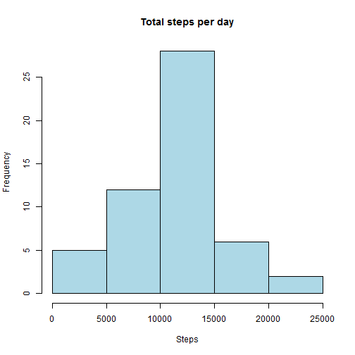
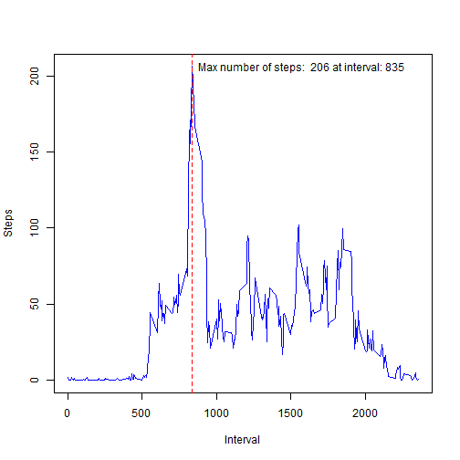
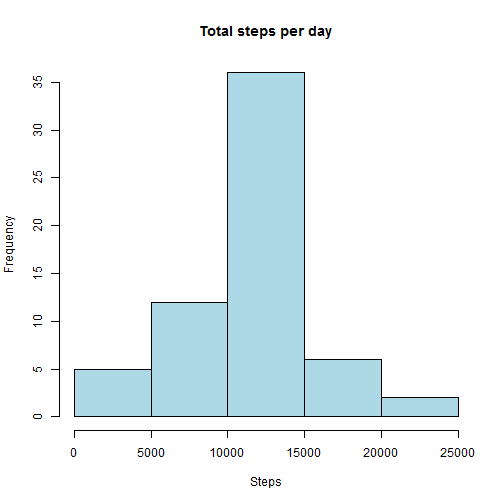
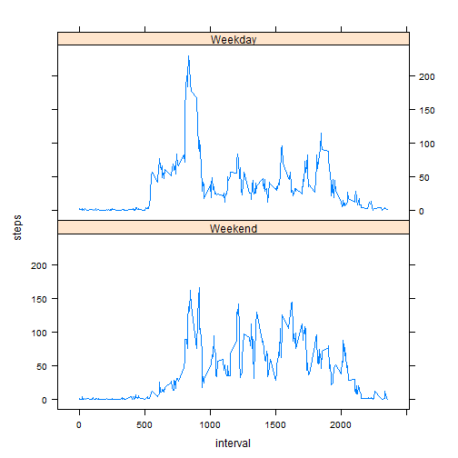

<br>
<br>

## Introduction   

<br>
<br>
It is now possible to collect a large amount of data about personal movement using activity monitoring devices such as a Fitbit, Nike Fuelband, or Jawbone Up. These type of devices are part of the "quantified self" movement - a group of enthusiasts who take measurements about themselves regularly to improve their health, to find patterns in their behavior, or because they are tech geeks. But these data remain under-utilized both because the raw data are hard to obtain and there is a lack of statistical methods and software for processing and interpreting the data.

This assignment makes use of data from a personal activity monitoring device. This device collects data at 5 minute intervals through out the day. The data consists of two months of data from an anonymous individual collected during the months of October and November, 2012 and include the number of steps taken in 5 minute intervals each day.

###Loading and preprocessing the data

Show any code that is needed to

1. Load the data (i.e. read.csv())    
    

```r
library(data.table)
```

```
## data.table 1.9.4  For help type: ?data.table
## *** NB: by=.EACHI is now explicit. See README to restore previous behaviour.
```

```r
tmp<-unz("repdata-data-activity.zip", "activity.csv")
close(tmp)
data<-read.csv("activity.csv")
```


2. Process/transform the data (if necessary) into a format suitable for your analysis

```r
    thedata <- aggregate(steps ~ date, data = data, sum, na.rm = TRUE)
```
###What is mean total number of steps taken per day?

For this part of the assignment, you can ignore the missing values in the dataset.

1. Make a histogram of the total number of steps taken each day

```r
hist(thedata$steps, col="lightblue", main="Total steps per day", xlab="Steps")
```

 

2. Calculate and report the mean and median total number of steps taken per day  

```r
    mean_total <- as.integer(mean(thedata$steps))
    median_total <- as.integer(median(thedata$steps))
```
<br>
    The mean total number of steps taken per day: ``10766``    
    The median total number of steps taken per day: ``10765``

###What is the average daily activity pattern?

1. Make a time series plot (i.e. type = "l") of the 5-minute interval (x-axis) and the average number of steps taken, averaged across all days (y-axis)

2. Which 5-minute interval, on average across all the days in the dataset, contains the maximum number of steps?


```r
    thedata<-aggregate(steps ~ interval, data = data, mean, na.rm = TRUE)
    maxsteps<-round(max(thedata$steps))
    maxinterval<-round(thedata$interval[thedata$steps==max(thedata$steps)])
    plot(x=thedata$interval, y=thedata$steps, col="blue", type="l", xlab="Interval", ylab="Steps")
    abline(v=maxinterval, col="red", lty=2)
    text(x=maxinterval,  y=maxsteps, label=paste("Max number of steps: ", 
                                                 maxsteps, "at interval:",maxinterval), pos=4)
```

 

###Imputing missing values

Note that there are a number of days/intervals where there are missing values (coded as NA). The presence of missing days may introduce bias into some calculations or summaries of the data.

1. Calculate and report the total number of missing values in the dataset (i.e. the total number of rows with NAs)

```r
    missingvalues <- sum(!complete.cases(data))
```

The total number of missing values in the dataset is: ``2304``
<br>
2. Devise a strategy for filling in all of the missing values in the dataset. The strategy does not need to be sophisticated. For example, you could use the mean/median for that day, or the mean for that 5-minute interval, etc.


```r
#strategy is to fill missing steps the average of steps for that interval
tmpmeanintervals<-aggregate(steps~interval, data=data, mean, na.rm=TRUE)
```

3. Create a new dataset that is equal to the original dataset but with the missing data filled in.


```r
    #copy of the original dataset
    tmpdata<-data
    # for loop to fill in the missing steps with the average steps for the interval
    #loop through each row in the copy of the original dataset
    for(x in 1:nrow(tmpdata)) {
        #check if the value for steps at that current row is missing
        if(is.na(tmpdata$steps[x])){
            #if it is get from the temporary table the mean steps for the interval
            #of the current row
            meanforthatinterval<-tmpmeanintervals$steps[tmpmeanintervals$interval==tmpdata$interval[x]]
            #replace the NA value
            tmpdata$steps[x]<-meanforthatinterval
        }
    }
```

4. Make a histogram of the total number of steps taken each day and Calculate and report the mean and median total number of steps taken per day. 


```r
#aggregate the new data
agg_tmpdata <- aggregate(steps ~ date, data = tmpdata, sum)
#aggregate the original data
agg_data <- aggregate(steps ~ date, data = data, sum)
#histogram of new data
hist(agg_tmpdata$steps, col="lightblue", main="Total steps per day", xlab="Steps")
```

 
   
Do these values differ from the estimates from the first part of the assignment? What is the impact of imputing missing data on the estimates of the total daily number of steps?

```r
    summary(agg_tmpdata$steps)
```

```
##    Min. 1st Qu.  Median    Mean 3rd Qu.    Max. 
##      41    9819   10770   10770   12810   21190
```

```r
    summary(agg_data$steps)    
```

```
##    Min. 1st Qu.  Median    Mean 3rd Qu.    Max. 
##      41    8841   10760   10770   13290   21190
```

###Are there differences in activity patterns between weekdays and weekends?

For this part the weekdays() function may be of some help here. Use the dataset with the filled-in missing values for this part.

1. Create a new factor variable in the dataset with two levels - "weekday" and "weekend" indicating whether a given date is a weekday or weekend day.

```r
    #load chron to get is.weekend function
    library(chron)
    #convert my date value to POSIXct
    tmpdata$date<-as.POSIXct(tmpdata$date)
    #create the factor variable
    tmpdata$Weekend<-is.weekend(tmpdata$date)
    tmpdata$Weekend<-factor(tmpdata$Weekend,levels=c(TRUE,FALSE), labels=c("Weekend","Weekday")) 
```

2. Make a panel plot containing a time series plot (i.e. type = "l") of the 5-minute interval (x-axis) and the average number of steps taken, averaged across all weekday days or weekend days (y-axis). See the README file in the GitHub repository to see an example of what this plot should look like using simulated data.

```r
    #load lattice for the xyplot
    library(lattice)
    #aggregate my info
    tmpdata<-aggregate(steps~interval+Weekend, data=tmpdata, mean, na.rm=TRUE)
    #create my plot
    xyplot(steps ~ interval | Weekend, data = tmpdata, type = "l", aspect = 1/2)
```

 
